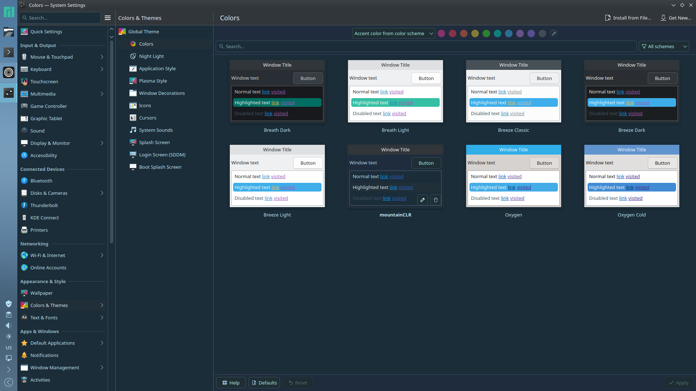

# MountainCLR
MountainCLR is a KDE Plasma theme with a sort of blue-esque style.

Here is a preview:

# Installation:

****gui method:****
- 1: open ksystemsettings.

  - 2: go to **colors & themes**.

- 3: select colors.

- 4: click "install from file...".

- 5: select mountainCLR.zip.
